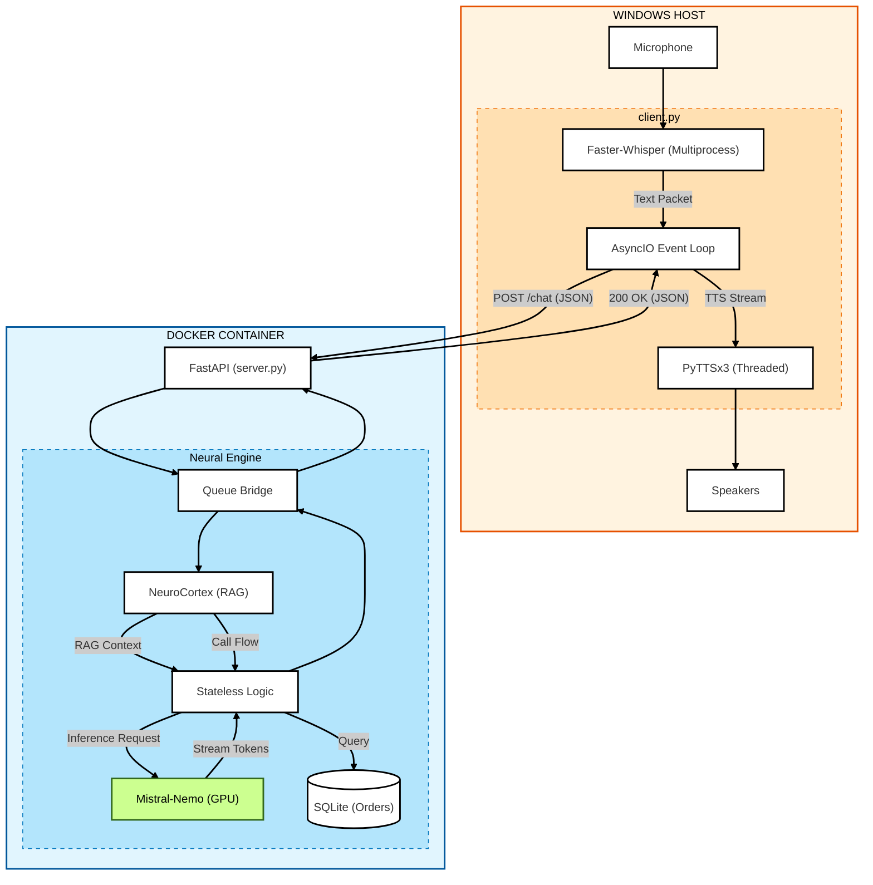

# SAIKO: Local-First AI Orchestrator

> **Status:** Alpha (v10)
> **Architecture:** Decoupled Client-Server (REST API)
> **Latency:** ~1.2s End-to-End (Voice-to-Voice)
> **Privacy:** 100% Offline / Zero-Egress

## Executive Summary
Saiko is a fully **containerized, private AI agent** designed for high-performance voice interaction on consumer hardware.

Unlike standard chatbots that rely on cloud APIs (OpenAI/Anthropic), Saiko runs a custom **ExLlamaV2 inference engine** locally, orchestrated by a stateless FastAPI backend. It features a custom "NeuroCortex" RAG system for instant policy retrieval and a self-healing SQLite database for transactional logic, achieving 3 to 1.2s latency without sending data to the cloud.

## System Architecture

