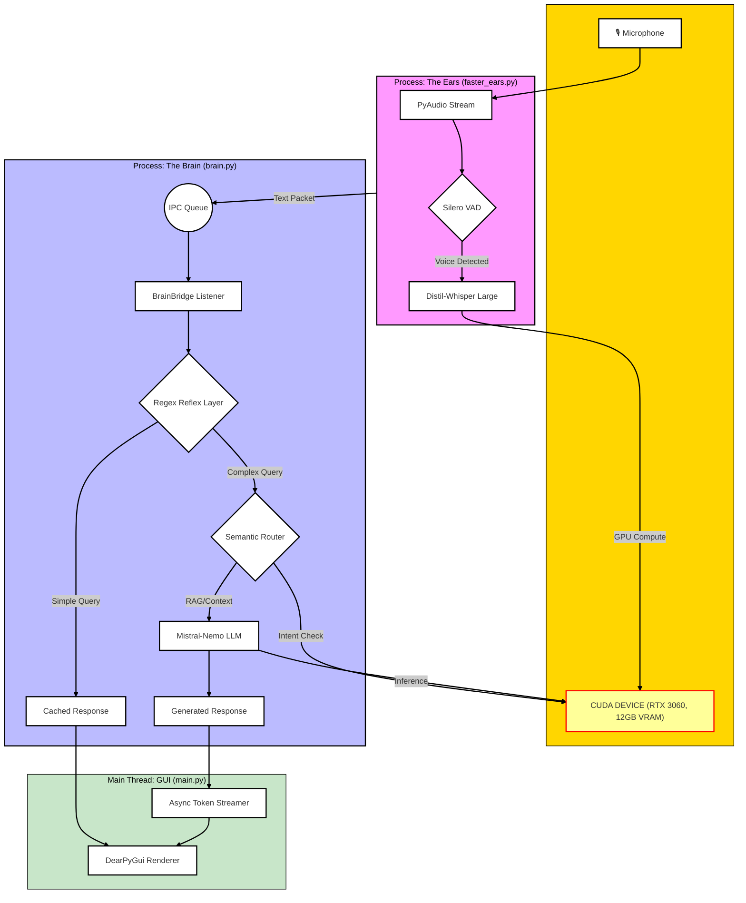

```mermaid
---
config:
  layout: fixed
  theme: neo
  look: classic
---
flowchart TB
 subgraph HARDWARE["<br>"]
        Mic["🎙️ Microphone"]
        GPU["CUDA DEVICE (RTX 3060, 12GB VRAM)"]
  end
 subgraph PROCESS_EARS["Process: The Ears (faster_ears.py)"]
    direction TB
        PyAudio["PyAudio Stream"]
        VAD{"Silero VAD"}
        Whisper["Distil-Whisper Large"]
  end
 subgraph PROCESS_BRAIN["Process: The Brain (brain.py)"]
    direction TB
        Bridge["BrainBridge Listener"]
        Regex{"Regex Reflex Layer"}
        Router{"Semantic Router"}
        LLM["Mistral-Nemo LLM"]
        Queue(("IPC Queue"))
        Response_Fast["Cached Response"]
        Response_Slow["Generated Response"]
  end
 subgraph PROCESS_UI["Main Thread: GUI (main.py)"]
        DPG["DearPyGui Renderer"]
        Stream["Async Token Streamer"]
  end
    Mic --> PyAudio
    PyAudio --> VAD
    VAD -- Voice Detected --> Whisper
    Whisper -- GPU Compute --> GPU
    PROCESS_EARS -- Text Packet --> Queue
    Queue --> Bridge
    Bridge --> Regex
    Regex -- Simple Query --> Response_Fast
    Regex -- Complex Query --> Router
    Router -- Intent Check --> GPU
    Router -- RAG/Context --> LLM
    LLM -- Inference --> GPU
    LLM --> Response_Slow
    Response_Fast --> DPG
    Response_Slow --> Stream
    Stream --> DPG

    style GPU fill:#ff9,stroke:#f00
    style PROCESS_EARS fill:#f9f,stroke:#000000,stroke-width:2px
    style PROCESS_BRAIN fill:#bbf,stroke:#000000,stroke-width:2px
    style HARDWARE stroke:#000000,fill:#FFD600
    style PROCESS_UI fill:#C8E6C9,stroke:#000000
```
